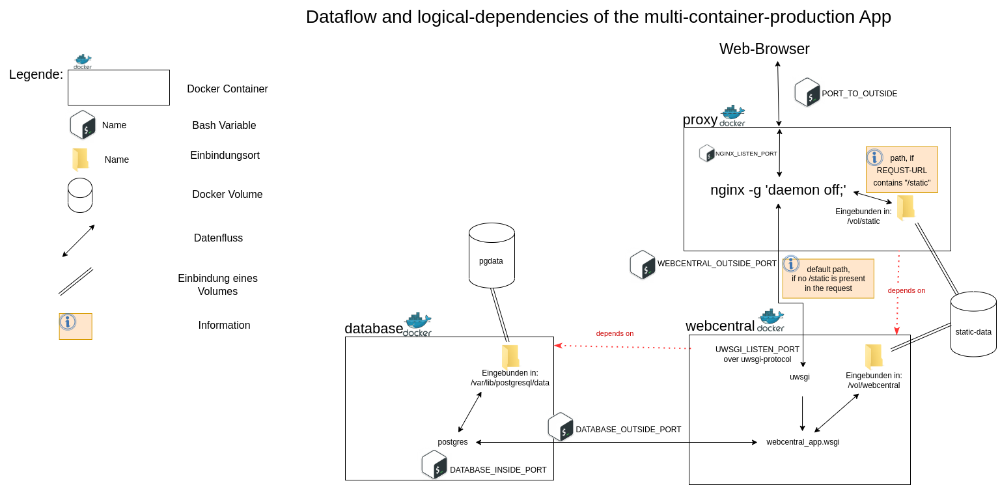
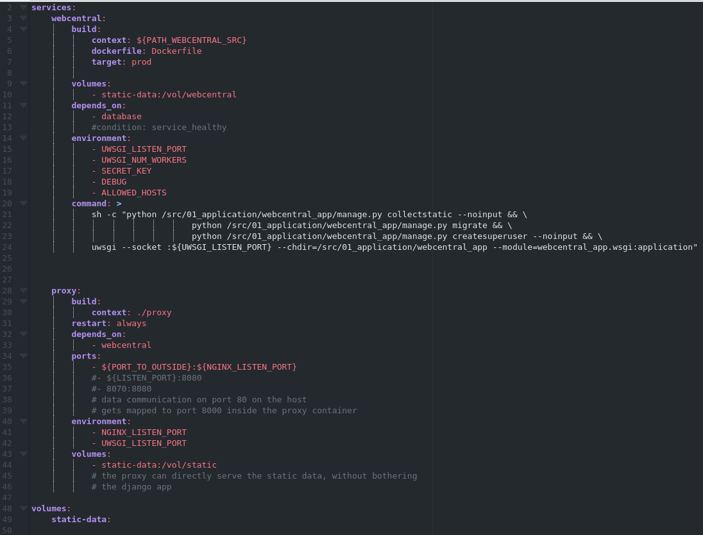

# Structure of the production multicontainer architecture
The structure and communication paths of the multi-container production environment are shown in Fig. 1. The containers participating in communication with a web browser are modeled as rectangles, and any data flows as arrows.

The web browser makes requests to the server. On the server, the "proxy" container listens for http requests via the "PORT_TO_OUTSIDE" port. PORT_TO_OUTSIDE" is a shell environment variable that is loaded into the shell that started the docker-compose project via the hidden text file ".env" when the docker-compose project is started. On the server, "PORT_TO_OUTSIDE" should be assigned the value 80 so that the "proxy" container listens for http requests on port 80. Incoming requests are passed to the "proxy" container and arrive there on the port that is stored in the variable "NGINX_LISTEN_PORT".
The application nginx (spoken Engine X) runs in the "proxy" container. It was started during the container startup process using the command "nginx -g daemon off;". This command starts the nginx program in the container in the foreground. This is in line with Docker's policy that only one program should run in a container at a time, and has the advantage, for example, that log messages are always forwarded to the docker-daemon, and can be viewed via the "docker log" command.
The "proxy" container takes the function of a "reverse proxy" (See also: https://en.wikipedia.org/wiki/Proxy_server). It acts as an intermediary unit and forwards the request according to its content. If the request URL contains a path to "static/", nginx accesses the respective static file, and delivers it to the web browser. Any other requested URL results in a redirect to the "webcentral" container, which contains the Django app "webcentral_app".

A nested structure is created in the nginx configuration file. The topmost structure is the "server" structure. In line 2, the key "listen" is added, which specifies the port on which nginx accepts requests. Here the variable "NGINX_LISTEN_PORT" is assigned. It should be noted here that "PORT_TO_OUTSIDE" should not be entered here: The request passed to the "proxy" container via "PORT_TO_OUTSIDE" will be forwarded to the container internal port "NGINX_LISTEN_PORT" inside the container using the container port mapping, and "NGINX_LISTEN_PORT" and "PORT_TO_OUTSIDE" could be different.
"location" structures are added in line 4 and 8. The "location" structure in line 4 performs a substitution in the requested path if "/static" occurs in the path. This partial path is then replaced by "/vol/static". In this way, static content is delivered from the Docker volume "static-data", which is mounted in the proxy container using the path "/vol/static". The command that mounts the "static-data" volume into the "proxy" container is located in the "docker-compose.prod.yml" file at line 44.

The second "location" structure in the nginx configuration file (Fig. 1) is used whenever the first "location" rule does not apply, i.e. when there is no "/static" in the request URL. This forwarding is defined as uwsgi forwarding. The HTTP request arriving in nginx is rewritten to the uwsgi protocol, and forwarded to the host defined by ${APP_HOST}:${UWSGI_LISTEN_PORT}. Here, the variable APP_HOST contains the name of the controller where the webcentral application resides (Fig. 1, line 9). Line 10 then includes the uwsgi_params file, which describes the mapping between HTTP and uwsgi protocols for nginx. In line 11, the maximum size of the request body is limited to 10 megabytes.
To access the static data in the "static-data" volume, the static data must be copied to the "static-data" volume when building the multi-container productive environment. This is done by setting the static-data folder in the "settings.py" to "/vol/webcentral" (line 140 in settings.py). By running `manage.py collectstatic --noinput` in "docker-compose.prod.yml" at line 21, the static data in the Django project is collected and updated in the "static-data" volume. Furthermore, the database is migrated and a django-admin is created if it does not already exist in the database. The --noinput parameter causes username, password and email to be set from the environment variables that were set in the ".env".

In the "webcentral" container, the uwsgi application server receives requests from nginx and forwards them to "wsgi.py", which is located in "webcentral_app/". In doing so, uwsgi listens via the port specified in "UWSGI_LISTEN_PORT". The Django app then processes the request received via uwsgi and creates a response, which is passed back to uwsgi, and from there to nginx. To create the response, the Django app has the option to query the postgres database or access the "static-data" volume that has been mounted in the webcentral container via the path "/vol/webcentral".
For the postgres application to be usable in the "database" container, the name, username, password and hostname of the database must be stored in settings.py. These were loaded into the container as environment variables when starting the "webcentral" container.
Furthermore a mechanism was implemented to overwrite the settings set in the "settings.py". This is possible by placing a file "local_settings.py" in the same folder where the "settings.py" is located. Furthermore, "USE_DOT_ENV" must be set to 0 in the .env file or the web app must be started directly via "python manage.py runserver" without a Docker environment.

The build process of the webcentral container is divided into two phases (hereafter Stages). This allows to create different environments. It is possible to create a "development" environment (dev for short) and a "production" environment (prod for short). Both environments are based on the same base build. This base build of the multi-container app is described in "docker-compose.yml". Here, the two containers "database" and "webcentral" are defined. In the context of docker-compose, the Docker containers are also called "services". The "database" container uses the image postres, which is loaded by docker-hub. Since no Docker tag was specified, the image with the tag "latest" is always loaded here. The ".env" file is also specified in the container definition. Using the environment variables "POSTGRES_USER", "POSTGRES_PASSWORD", "POSTGRES_DATABASE" stored here, the database is accessed, which is stored in the "pgdata" volume and mounted in the container in "/var/lib/postgresql/data". If the database does not exist in this location, it will be created.
With the help of the "healthcheck" command, it can be ensured that the database is still working smoothly, and if errors occur, it can be reacted to accordingly. At the moment, however, no reaction to errors is implemented. It would be possible, for example, to start the "webcentral" container only when the "database" container sends the signal "service_healthy". This way it could be ensured that the webcentral container only starts when the database is fully up (possibly relevant for large databases?).
In the build process of the "webcentral" container in the base build, a "webcentral" image is created from the Dockerfile located in the root folder of the "webcentral" git repository. For the base image, only the part of the Dockerfile marked as "base" is used. During the build process of the "base" image, the "python3.10" image is used as a basis. image is used as a base, in which the python packages listed in the "requirements.txt" are then installed.
This basic "docker-compose" project can be started via `docker-compose docker-compose.yml up`. However, it is not commonly used like this, since the Django app is not yet included. This can be done by specifying another `.yml` file, which specifies whether a dev or a prod build is created. Running the command `docker-compose -f docker-compose.yml -f docker-compose.prod.yml up` will create the production environment of the multi-container app. In the process, another buildstage is added to the "base" webcentral container. This is visible in the Dockerfile under the target name "prod". There, all files are copied from the webcentral git repository to the webcentral container.
For the dev environment, the command `docker-compose -f docker-compose.yml -f docker-compose.dev.yml up` is executed. Here, instead of copying the files from the webcentral Django folder, it is included as a folder in the `webcentral` container. This way, changes in the source code can be made directly visible without having to rebuild the Docker compose project. Furthermore, the Django project runs on top of the Django development server.

*German Translation from 07.03.2023*

# Aufbau der Produktions-Multicontainer-Architektur
Aufbau und Kommunikationswege der Multi-Container-Produktionsumgebung sind in Abb. 1 dargestellt. Es werden die an der Kommunikation mit einem Webbrowser teilnehmenden Container als Rechtecke, und eventuelle Datenflüsse als  Pfeile modelliert.

Der Webbrowser stellt Anfragen an den Server. Auf dem Server lauscht der "proxy"-Container über den Port "PORT_TO_OUTSIDE" auf http-Anfragen. Dabei handelt es sich bei "PORT_TO_OUTSIDE" um eine shell-Umgebungsvariable, welche beim Starten des docker-compose Projekts über die versteckte-Textdatei ".env" in die Shell geladen wird, in welche das docker-compose Projekt gestartet hat. Auf dem Server sollte "PORT_TO_OUTSIDE" mit dem Wert 80 belegt werden, damit der "proxy"-Container auf dem Port 80 auf http-Anfragen lauscht. Ankommende Anfragen werden in den "proxy"-Container übergeben, und kommen dort auf dem Port an, welcher in der Variable "NGINX_LISTEN_PORT" hinterlegt ist.
Im "proxy"-Container läuft die Anwendung nginx (gesprochen Engine X). Sie wurde während des Startvorgangs des Containers über den Befehl "nginx -g daemon off;" gestartet. Dieser Befehl startet das nginx-Programm im Container im Vordergrund. Dies entspricht der Docker-Policy, dass in einem Container immer nur ein Programm laufen sollte und hat bespielsweise den Vorteil, dass Log-Nachrichten immer an den docker-daemon weitergeleitet werden, und über den "docker log"-Befehl angezeigt werden können.
Der "proxy"-Container nimmt die Funktion eines "reverse proxy" ein (Siehe auch: https://en.wikipedia.org/wiki/Proxy_server). Er fungiert als Vermittlungseinheit und leitet die Anfrage entsprechend ihres Inhalts weiter. Enthält die Anfrage-URL einen Pfad nach "static/", greift nginx auf die jeweilige statische Datei zu, und liefert sie an den Webbrowser aus. Jede andere angefragte URL führt auf eine Weiterleitung in den "webcentral"-Container, welcher die Django-App "webcentral_app" enthält.

In der nginx-Konfigurationsdatei wird eine verschachtelte Struktur erstellt. Die oberste Struktur ist die "server"-Struktur. In Zeile 2 wird der Schlüssel "listen" hinzugefügt, welcher den Port spezifiziert, auf dem nginx Anfragen entgegennimmt. Hier wird die Variable "NGINX_LISTEN_PORT" zugewiesen. Es ist hier zu beachten, dass hier nicht "PORT_TO_OUTSIDE" eingetragen werden sollte: Die Anfrage, welche über "PORT_TO_OUTSIDE" an den "proxy"-Container übergeben wurde, wird innerhalb des Containers mithilfe des Container-Port-Mappings an den Container internen Port "NGINX_LISTEN_PORT" weitergeleitet und "NGINX_LISTEN_PORT" und "PORT_TO_OUTSIDE" könnten sich unterscheiden.
In Zeile 4 und 8 werden "location"-Strukturen hinzugefügt. Die "location"-Struktur in Zeile 4 führt eine Ersetzung im angforderten Pfad vor, wenn im Pfad "/static" vorkommt. Dieser Teilpfad wird dann durch "/vol/static" ersetzt. Auf diese Weise werden statische Inhalte aus dem Docker Volume "static-data", welches in den proxy-Container über den Pfad "/vol/static" eingebunden wird, ausgeliefert. Das Kommando, welches das "static-data" Volume in den "proxy"-Container einbindet, befindet sich in der "docker-compose.prod.yml" Datei in Zeile 44.

Die zweite "location"-Struktur in der nginx-Konfigurationsdatei (Abb. 1) wird immer dann benutzt, wenn die erste "location"-Regel nicht greift, wenn also kein "/static" in der Request-URL vorkommt. Diese Weiterleitung wird als uwsgi-Weiterleitung definiert. Der in nginx ankommende HTTP-Request wird in das uwsgi-Protokoll umgeschrieben, und an den Host, welcher über ${APP_HOST}:${UWSGI_LISTEN_PORT} definiert wird, weitergeleitet. Dabei enthält die Variable APP_HOST den Namen des Contianers, in der die webcentral Applikation liegt (Abb. 1, Zeile 9). In Zeile 10 wird dann die uwsgi_params Datei eingebunden, welche für nginx das Mapping zwischen HTTP- und uwsgi-Protokoll beschreibt. In Zeile 11 wird die maximale Größe des Request-Bodies auf 10 Megabyte begrenzt.
Um auf die statischen Daten im "static-data" Volume zugreifen zu können, müssen die statischen Daten beim Bau der Multi-Container-Produktiv-Umgebung in das "static-data" Volume kopiert werden. Dies geschieht, indem in der "settings.py" der ordner für statische Daten auf "/vol/webcentral" gelegt wird (Zeile 140 in settings.py). Durch das Ausführen von `manage.py collectstatic --noinput` in "docker-compose.prod.yml" in Zeile 21 werden die statischen Daten im Django-Projekt zusammengetragen und im "static-data" Volume aktualisiert. Weiterhin wird die Datenbank migriert und ein django-admin erstellt, falls dieser noch nicht in der Datenbank vorhanden ist. Der Parameter --noinput führt dazu, dass Username, Passwort und Email aus den Umgebungsvariablen gesetzt werden, welche im ".env" gestfelegt wurden.

Im "webcentral"-Container nimmt der uwsgi-Applikationsserver Anfragen von nginx entgegen und leitet sie an die "wsgi.py" weiter, welche sich in "webcentral_app/" befindet. Dabei lauscht uwsgi über den Port, welcher in "UWSGI_LISTEN_PORT" festgelegt wird. Die Django-App verarbeitet dann die über uwsgi erhaltene Anfrage und erstellt eine Response, welche zurück an uwsgi, und von dort an nginx weitergeleitet wird. Zum Erstellen der Response hat die Django-App die Möglichkeit an die postgres-Datenbank Anfragen zu stellen oder auf das "static-data"-Volume zuzugreifen, welches über den Pfad "/vol/webcentral" in den webcentral-Container eingebunden wurde.
Damit die postgres-Anwednung im "database"-Container nutzbar ist, müssen in der settings.py Name, Benutzername, Passwort und Hostname der Datenbank hinterlegt werden. Diese wurden als Umgebungsvariablen beim Starten des "webcentral"-Containers in den Container geladen.
Weiterhin wurde ein Mechanismus eingebaut, um die in der "settings.py" gesetzten Einstellungen zu überschreiben. Dies ist möglich, indem eine Datei "local_settings.py" im selben Ordner abgelegt wird, in dem auch die "settings.py" liegt. Weiterhin muss in der .env-Datei "USE_DOT_ENV" auf 0 gesetzt werden oder die web-App ohne Docker-Umgebung direkt über "python manage.py runserver" gestartet werden.

Der Build-Prozess des webcentral-Containers ist in zwei Phasen (im Folgenden Stages) eingeteilt. Dies ermöglicht es verschiedene Umgebungen zu erstellen. So ist es möglich eine "development"-Umgebung (kurz dev) und eine "Produktions"-Umgebung (kurz prod) zu erstellen. Dabei bauen beide Umgebungen auf demselben Base-Build auf. Dieser Base-Build der Multi-Container-App wird in "docker-compose.yml" beschrieben. Hier werden die beiden Container "database" und "webcentral" definiert. Im Kontext von docker-compose werden die Docker-Container auch "services" genannt. Der "database"-Container verwendet das Image-postres, welches von docker-hub geladen wird. Da kein Docker-Tag angegeben wurde, wird hier immer das Image mit dem Tag "latest" geladen. Die ".env"-Datei wird bei der Container-Definition ebenfalls angegeben. Mithilfe der hier hinterlegten Umgebungsvariablen "POSTGRES_USER", "POSTGRES_PASSWORD", "POSTGRES_DATABASE" wird auf die Datenbank zugegriffen, welche im Volume "pgdata" hinterlegt ist und im Container in "/var/lib/postgresql/data" eingebunden wird. Falls die Datenbank an diesem Ort nicht existiert, wird sie erstellt.
Mithilfe des "healthcheck"-Kommandos kann sichergestellt werden, dass die Datenbank noch reibungslos funktioniert, und bei Fehlern entsprechend reagiert werden. Momentan ist aber noch keine Reaktion auf Fehler implementiert. Es wäre aber zum Beispiel möglich, den "webcentral"-Container erst zu starten, wenn der "database"-Container das Signal "service_healthy" sendet. Auf diese Weise könnte sichergesetllt werden, dass der webcentral-Container erst dann startet, wenn die Datenbank vollständig hochgefahren ist (Eventuell relevant bei großen Datenbanken?).
Im Build-Prozess des "webcentral"-Containers im Base-Build wird ein "webcentral"-Image aus dem Dockerfile erstellt, welches sich im Wurzel-Ordner des "webcentral"-Git-Repositories befindet. Für das Base-Image wird nur der Teil des Dockerfiles verwendet, welcher als "base" markiert ist. Beim Build-Prozes des "base"-Images wird als Grundlage das "python3.10" Image verwendet, in welchem dann die python-Packages installiert werden, welche in der "requirements.txt" aufgeführt sind.
Dieses grundlegende "docker-compose"-Projekt kann über `docker-compose docker-compose.yml up` gestartet werden. Es ist allerdings so nicht gebräuchlich, da die Django-App noch nicht mit eingebunden ist. Dies kann durch Angabe einer weiteren ".yml"-Datei geschehen, welche vorgibt, ob ein dev- oder ein prod-build erstellt wird. Durch Ausführen des Befehls `docker-compose -f docker-compose.yml -f docker-compose.prod.yml up` wird die Produktionsumgebung der Multi-Container App erstellt. Dabei wird dem "base"-webcentral-Container eine weitere Buildstage hinzugefügt. Diese ist im Dockerfile unter dem Target-Namen "prod" sichtbar. Dort werden alle Dateien aus dem webcentral-Git-Repository in den webcentral-Container kopiert.
Für die dev-Umgebung wird der Befehl `docker-compose -f docker-compose.yml -f docker-compose.dev.yml up` ausgeführt. Hier wird, statt die Dateien aus dem webcentral-Django-Ordner zu kopieren, dieser als ordner in den "webcentral"-Container eingebunden. So können Änderungen im Quellcode direkt sichtbar gemacht werden, ohne das Docker-Compose projekt neu bauen zu müssen. Weiterhin läuft das Django-Projekt über dem Django-Development-Server.
