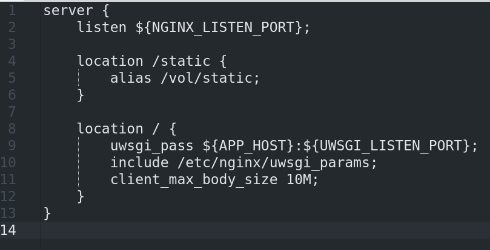

# Aufbau der Produktions-Multicontainer-Architektur
Aufbau und Kommunikationswege der Multi-Container-Produktionsumgebung sind in Abb. 1 dargestellt. Es werden die an der Kommunikation mit einem Webbrowser teilnehmenden Container als Rechtecke, und eventuelle Datenflüsse als  Pfeile modelliert.
Der Webbrowser stellt Anfragen an den Server. Auf dem Server lauscht der "proxy"-Container über den Port "PORT_TO_OUTSIDE" auf http-Anfragen. Dabei handelt es sich bei "PORT_TO_OUTSIDE" um eine shell-Umgebungsvariable, welche beim Starten des docker-compose Projekts über die versteckte-Textdatei ".env" in die Shell geladen wird, welche das docker-compose Projekt gestartet hat. Auf dem Server sollte "PORT_TO_OUTSIDE" mit dem Wert 80 belegt werden, damit der "proxy"-Container auf dem Port 80 auf http-Anfragen lauscht. Ankommende Anfragen werden in den "proxy"-Container übergeben, und kommen dort auf dem Port an, welcher in der Variable "NGINX_LISTEN_PORT" hinterlegt ist.

Im "proxy"-Container läuft die Anwendung nginx (gesprochen Engine X). Sie wurde während des Startvorgangs des Containers über den Befehl "nginx -g daemon off;" gestartet. Dieser Befehl startet das nginx-Programm im Container im Vordergrund. Dies entspricht der Docker-Policy, dass in einem Container immer nur ein Programm laufen sollte und hat bespielsweise den Vorteil, dass Log-Nachrichten immer an den docker-daemon weitergeleitet werden, und über den "docker log"-Befehl angezeigt werden können.
Der "proxy"-Container nimmt die Funktion eines "reverse proxy" ein (Siehe auch: https://en.wikipedia.org/wiki/Proxy_server). Er fungiert als Vermittlungseinheit und leitet die Anfrage entsprechend ihres Inhalts weiter. Enthält die Anfrage-URL einen Pfad nach "static/", greift nginx auf die jeweilige statische Datei zu, und liefert sie an den Webbrowser aus. Jede andere angefragte URL führt auf eine Weiterleitung in den "webcentral"-Container, welcher die Django-App "webcentral_app" enthält.

In der nginx-Konfigurationsdatei wird eine verschachtelte Struktur erstellt. Die oberste Struktur ist die "server"-Struktur. In Zeile 2 wird der Schlüssel "listen" hinzugefügt, welcher den Port spezifiziert, auf dem nginx Anfragen entgegennimmt. Hier wird die Variable "NGINX_LISTEN_PORT" zugewiesen. Es ist hier zu beachten, dass hier nicht "PORT_TO_OUTSIDE" eingetragen werden sollte: Die Anfrage, welche über "PORT_TO_OUTSIDE" an den "proxy"-Container übergeben wurde, wird innerhalb des Containers mithilfe des Container-Port-Mappings an den Container internen Port "NGINX_LISTEN_PORT" weitergeleitet und "NGINX_LISTEN_PORT" und "PORT_TO_OUTSIDE" könnten sich unterscheiden.
In Zeile 4 und 8 werden "location"-Strukturen hinzugefügt. Die "location"-Struktur in Zeile 4
