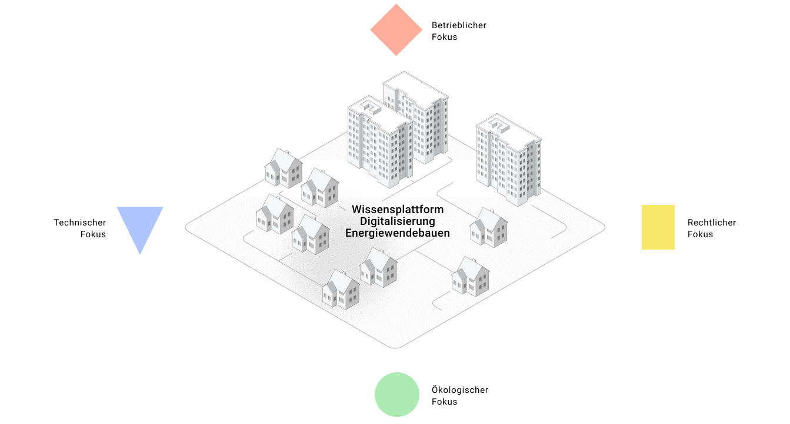
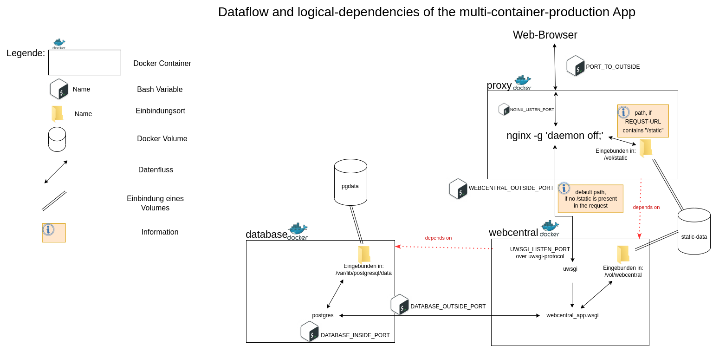

<p align="center">
  
</p>

# WenDE – Wissensplattform 

The shift from a traditional supply infrastructure to a regenerative, decentralized energy system introduces increased complexity and necessitates the integration of previously independent sectors. The efficient operation of these systems relies on modern IT communication and control technologies. This transition poses significant changes and new challenges for all stakeholders, alongside a substantial need for research.

Research, development, and innovation projects in the field of energy in buildings, construction, as well as real-world energy transition laboratories, focus on various aspects of this multifaceted topic. They conduct in-depth analyses of the economic, political, and user-specific requirements and challenges.

A key objective of the WenDE project is to simplify and disseminate the findings from these projects. The EWB knowledge platform is being developed as a central element of this initiative. It serves as a repository where knowledge is aggregated and tailored for different user groups. The platform emphasizes the visual presentation of data, examines the impacts of varying conditions, and facilitates the application of technological advancements. It also involves the verification of digital tools and supports the testing and development of new methodologies.
A web interface with database system conatins project infromation of and from the "Begleitforschung Energiewendebauen 2020" (03EWB004A-C). The title of this system is: "Wissensplattform".

# Main concept

The Web-Application consists of three services, which are containerized, with each running in a seperate container. In the backend, the python based `Django`-Framework is used. Data is stored in a relational-database, wtih `PostgreSQL` chosen as the DBMS. A `nginx`-instance is used as a reverse-proxy to redirect HTTP-requests to the `Django`-Backend, using the `uwsgi`-protocol. Static-content is directly served by `nginx` as it has access to a `Docker`-Volume, which is shared with the `Django`-application.


# How to use 

To start all needed services, networks, and volumes Docker-compose can be used. Is is possible to use the app in development- or production-mode. As a prerequesite, the `.env.example`-file needs to be reviewed. It contains the secrets of the application. Please change the values of the environmental-variables inside there. E.g. the `DJANGO_SUPERUSER_USERNAME` contains the username, which can be used to access the admin-panel and `DJANGO_SUPERUSER_PASSWORD` is the corresponding password. With the `POSTGRES_*`-variables a database with the name `POSTGRES_DB` together with a database-user `POSTGRES_USER` is created on the first startup of the Application. The created database lives in the volume `pgdata`. When changing the values of the `POSTGRES_*`-variables after database creation, it wont be possible for the web-application to access the database.

1. As a first step a `.env`-file needs to be created from the `.env.example`-file. On linux, that can be done with the `cp`-command. From within the project-folder execute the following command in a shell:

```
   cp .env.example .env
```
1. Execute the command `npm install` to install the `node.js`-dependencies these are used to transpile the `scss`-stylesheets into a bundled `css`-stylesheet.
1. To build the development environment execute:
```
    ./run build_initial dev
```
1. In the `Wissensplattform` images like logos of in the database included tools, are not located in the repository. These files have to be downloaded from the following link `https://tubcloud.tu-berlin.de/f/3546499069`. The `media`-folder has to be copied to `webcentral/src/`.
1. Start the setup process by calling the run script with the argument `up_initial` and providing a database dump file.
```
  ./run up_initial dev postgres/webcentral_db_20240910_rm_session_data.sql
```
If the app should is to be started in production-mode, SSL-certificates need to be provided to the `nginx`-instance. The files need to be put into the `proxy/conf/`-folder. If the `conf/`-folder does not exist, it needs to be created. The filename of the SSL-Certificate and the SSL-Certificate Key need to be placed inside the `NGINX_SSL_CERTIFICATE_FILENAME` and `NGINX_SSL_CERTIFICATE_KEY_FILENAME` respectivly. 

1. After that, the `run`-script can be used to start the project.

For the development-mode use:


```
   ./run up dev
```

For the production-mode use:

```
   ./run up prod
```

Now that the app is running it is possible to eighter import dummy-data or start with an empty database.
Please consult the [documentation](https://tub-dvg.github.io/wissen-digital-ewb/) for further details.

## Importing Dummy-Data

For importing the dummy-data the `run`-script can be used. Open a seperate terminal, while the app is still running in the first shell and execute:

```
   ./run restore_db postgres/dummy_data.sql
```

That imports the sql-dump from the `postgres`-folder into the database. After that go back to the shell where the web-app is running and stop it by pressing ``CTRL+C` and restart it with the `./run up <env>` command. You can access the web-app UI by going to 

```
   http://127.0.0.1:8000
```
when you started the development environment or 

```
   https://127.0.0.1
```
when started in production mode. Please note, that SSL-certificates need to be provided to run the production environment.

## Starting the App with an empty database

Leave the app running in the terminal and open another one. There run the following two commands:

```
   ./run makemigrations
```

and 

```
   ./run migrate
```

After that, restart the app from the first terminal by pressing `CTRL+C` and run the command `./run up <env>` again.

## Style Guide

The Style guide for the project can be viewed [here](./styleGuide.md).   

# How to Contribute:   

We welcome data contributions to our database system! To ensure consistency and ease of use, we have created specific templates for various types of data contributions. By following the instructions and using the appropriate template, you help us maintain high-quality data for everyone. Below are the steps to contribute your data, as well as the different types of contributions we accept.   

1. **Select the Appropriate Template**:  
   We have prepared several templates depending on the type of data you wish to contribute:   

   - **Datasets Contribution**: For contributing datasets related to environmental, energy, or any other scientific data. For further information, please visit our website of [Datasets](https://wissen-digital-ewb.de/en/dataset_list/).
   - **Norm Data Contribution**: For contributing information about technical standards and norms. For further information, please visit our website of [Norms](https://wissen-digital-ewb.de/en/TechnicalStandards/norm).
   - **Protocol Data Contribution**: For contributing details on technical protocols used in systems. For further information, please visit our website of [Protocols](https://wissen-digital-ewb.de/en/TechnicalStandards/protocol).
   - **Weather Data Contribution**: For contributing weather-related datasets or applications. For further information, please visit our website of [Weather Data](https://wissen-digital-ewb.de/en/weatherdata_list/).
   - **Tools/Application Data Contribution**: For contributing information about digital applications and digital tools that are used, developed or further developed. For further information, please visit our website of [Digital Tools](https://wissen-digital-ewb.de/en/tool_list/) and [Digital Applications](https://wissen-digital-ewb.de/en/tool_list/technicalApps/).   
   
   Each template can be found under the "Issues" section of this repository.   

1. **Fill in the Template**:  
   Click on ["New Issue"](https://github.com/TUB-DVG/wissen-digital-ewb/issues/new/choose) under the "Issues" section, and select the appropriate template for your data contribution. Each template is designed with specific questions and required fields. Please provide as much detail as possible and ensure that your data is accurate and up-to-date..

1. **Submit Your Contribution**:  
   Once you have filled out the template, click "Submit" to send your contribution for review. Our team will review the submission and contact you if any additional information is needed.   

Thank you for helping us build a robust and comprehensive database system! If you have any questions regarding the contribution process, feel free to [open an issue](https://github.com/TUB-DVG/wissen-digital-ewb/issues/new/choose).      

# Hosted 

[wissen-digital-ewb.de](https://wissen-digital-ewb.de)

## License / Copyright

This software was originally developed by the [Institute for Digital Networking of Buildings, Energy Supply Systems and Users](https://www.tu.berlin/en/dvg) at the Technical University of Berlin. Since 2025 the [Projektträger Jülich (PTJ)](https://www.ptj.de/en/landing-page) is responsible for the maintenance and further development of the software.

This repository is licensed under [MIT License](LICENSE). 

This repo contains images, which have been created using the open-source [Privay Icons](https://github.com/Privacy-Icons/Privacy-Icons). 


# Funding


We gratefully acknowledge the financial support by the Federal Ministry for Economic Affairs and Climate Action (BMWK), promotional reference: 03EWB004A-C.

# Alumni

## Contributors Software (in no particular order)

Falk Cudok, Felix Rehmann, Rita Streblow, Martin Tobias Degner, Siling Chen, Ibukun Odeyemi, Kaifeng Xu, Ngoc Long Nguyen, Johanna Tengler, Marius Bieker

## Contributors Content (in no particular order)

Astrid Aretz, Swantje Gährs, Jan Kegel, Torsten Grothmann, Valentin Rupp, Max von Grafenstein, Isabel Kiefaber, Falk Cudok, Felix Rehmann, Rita Streblow, Martin Tobias Degner, Siling Chen, Ibukun Odeyemi, Kaifeng Xu, Ngoc Long Nguyen, Johanna Tengler, Marius Bieker

# Contact

[ptj-ewb@ptj.de ](mailto:ptj-ewb@ptj.de)


