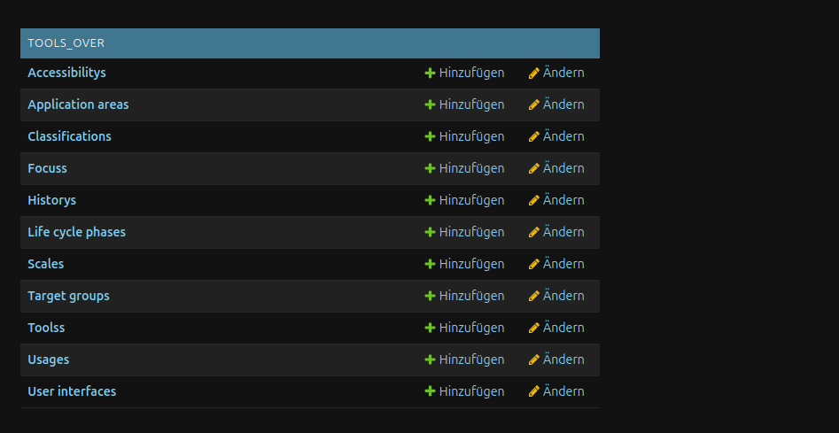
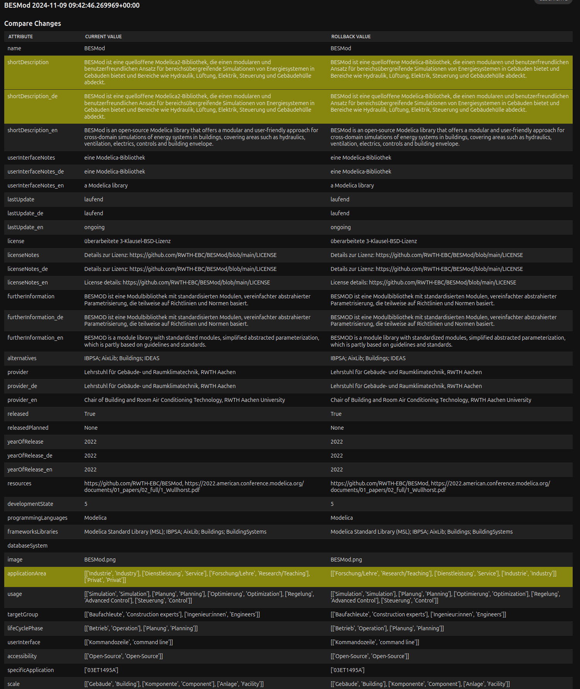
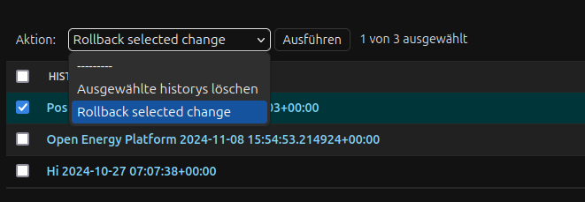

# Updating and rollback tools
In this guide it is shown how a bulk update and import of tools and digital applications can be done using csv/excel-files. First a up-to-date excel file is needed, which holds the german and english data of all tools of the database. This file can be exported from the database using the django custom management command `data_export`:

1. Open a terminal in the root of the project repository. Ensure that the app is running (in this guide the development mode is used). Switch into the shell of the `webcentral` docker container: 
```
    ./run webcentral_shell
```
And move into the `src/` directory:
```
    cd src/
```
2. Export a file `tools_latest_dump.xlsx`:
```
    python manage.py data_export tools_latest_dump.xlsx
```
When using the development-mode the file will be available in `webcentral/src/`-folder. 
```{note}
    If the production-mode was used to export the excel-file, it has to be copied out of the docker container using the docker cp-command from a terminal within the host-system

```
3. Update the content of the excel-file.
4. Import the excel file using the `data_import`-command:
```
   python manage.py data_import tools_over tools_latest_dump.xlsx
```
When updating a tool or application creates a new state of the tool in the database a `History` object is created. 
In that object the old state of the tool is saved as a stringified JSON object. When a rollback needs to be done, the following steps can be taken:
5. Login into the admin panel. The credentials can be fund in the `.env`-file.
6. Find the `History`-tab on the left side of the admin panel inside the `tools_over`-menu.
 
Click on the history-element to be redirected to the history object listing page. There all history objects are shown, whereby each object is named after the tool or digtal application its state it is saving and the timestamp at which the update for the tool was done. When clicking on one of the history object a details page should open, which should look like the following:

On the left side the current state of the tool `BESMod` is shown. On the right side the state is show to which the tool potentially could be rollbacked. The lines with the yellow background show, where attributes differ between the current state and the rollback state. To rollback the tool-state the user needs to go back to the history listing page and select the tool states, which should be rolled back:

After selecting the tools, which should rollback, select from the actions dropdown menu `Rollback selected change` and press apply.
The history object should then disappear and the state of the selected tools should be rollbacked.
