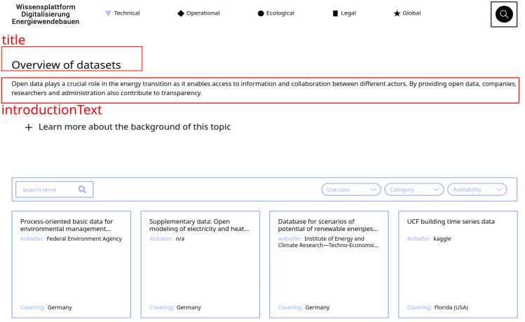
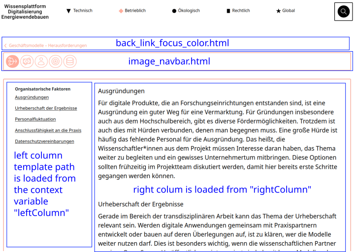

# Template structure
The django template language allows to load dynamic content into HTML-templates. These templates can be composed together from different smaller templates, allowing to follow a DRY-approach and increase readability and maintainability. In the following section the structure of the templates used in EWB-Wissensplattform is described in detail.

## Grid listing pages
The grid listing style page is used several times on the website to show and filter collections of tools, datasets, norms- & technical standards etc. The following figure shows the template components, which combined together build a listing-grid style page. This is done for the use-cases page: 
```{mermaid}
graph TD;
    pages/listing_grid.html --> partials/explanation_show_more.html;
    pages/listing_grid.html --> partials/search_bar.html;
    partials/explanation_show_more.html --> use_cases/explanation.html;
    pages/listing_grid.html --> partials/listing_results.html;
    partials/listing_results.html --> partials/pagination.html;
```
A template from the `pages/`-template folder acts as a base template. Into this template partial-temlates are included from the template folder `partials/`. 
A partial can also contain a template: The `partials/explanation_show_more.html`-template provides the general structure for the collapsable-component, which holds the explanation text for the current-site. The explanation text itself is app-specific static content, which is loaded from the app-template directory, in the example above from the `use_cases/`-directory.
The universal templates from the folders `partials/` and `pages/` need data from the app specific `views.py` method as context. The needed data is described in the following sections.

### Context for listing_grid.html
The following key value pairs need to be given in a dictionary to the django `render()`-method when rendering the `pages/listing_grid.html` template. 
`title`: Page title of the listing page.
`focusBorder`: Can be `technical`, `operational`, `ecological`, `legal` or `global`. Based on the used focus name, the border of the content container is colored in the color put inside the `_variables.scss`-file in `/webcentral/src/webcentral_app/static/css/`

### Context for explanation_show_more.html
`focusBorder`: Can be `technical`, `operational`, `ecological`, `legal` or `global`. Based on the selected value, the expanded explanation container will have the color of the respective focus.
`title`: Global heading of the listing page.
`introductionText`: Introductionary text shown under the `title`
`pathToExplanationTemplate`: Describes where the template-engine can find the app-specific explanation template. An example is `use_cases/explanation.html`, which holds the markup text, which is shown when clicking on the `+ Learn more about the topic` text on the [use-cases](https://wissen-digital-ewb.de/en/useCases_list/) listing page.

The image above shows where the context variables are rendered.


### Context for search_bar.html


### Context for listing_results.html
`page`: Contains a django pagination object, which is instanciated inside the view function. That object contains all ORM-objects, which should be listed on the gird listing.
`urlDetailsPage`: Contains the name of the route to the details page corresponding to the current listing page. The route name can be found in the app specific `urls.py` file.
Below listing shows an example of the route definition of the tools details page inside the `tools_over/urls.py` file. The name of the route can be found as the `name`-attribute inside the call of the `path()`-function:
```
path("<str:id>", views.toolView, name="tool_view"),
```
`subHeading1`: Sub heading name inside a listing
`subHeadingAttr1`: Shown attribute from the underlying django ORM-model. When the elements from a Many2Many-Field should be shown please use the double underscore `__` append the attribute in the referenced model, e.g. `lifeCyclePhase__name` displays the elements connected via the `lifeCyclePhase` attribute, whereby the connected objects have a attribute `name`.The `name` attributes of the conneted elements are concatenated and separated by ",".
`subHeading2`: Name of the shown attribute below the image in a listing element.
`subHeadingAttr2`: To be show attribute of the ORM-object. Please read the description of `subHeadingAttr1` to understand how to render Many2Many attributes.

## Details page structure
Each listing element links to a details page, on which all attributes of the data-object are shown. The template structure of the details page is shown in the following figure:
```{mermaid}
graph TD;
    pages/details_page.html --> partials/back_link_focus_color.html;
    pages/details_page.html --> partials/images_navbar.html;
    pages/details_page.html --> partials/left_column_details_page_technical_focus.html;
    pages/listing_grid.html --> tools_over/details_right_column.html;
```
It shows one example of the composition of a details page, here for the `tools_over/` app. On top of the page are two optional widgets. The first one includes a back link to the coresponding listing site. Below that widget a optional nav-bar like widget is available, which allows to fast click through all elements of the same kind via clicking a icon. 
Below that, the main content container is present. it is composed of 2 columns. For these 2 columns, depending on the app, different templates can be used. The path to the left column template is given via the context variable `leftColumn` while the path to the right is given via the context variable `rightColumn`. The structure can be seen in the following picture:


### Context for details_page.html

