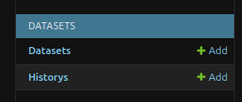

# Data-Import

This document describes the different ways to import data into the webcentral-database.
In general, data can be imported using the following ways:
    
- Using the django-admin panel.
- Using the custom django `data_import` command.
- Using a SQL-dump.

In the following sections these methods are described in detail.

## Data-import using the django admin panel
This approach can be considered straight forward. If only small chunks of data need to be imported, this method is apropriate. For that method to work, the django superuser-credentials are needed, which can be found in the `.env`-file in the root project folder.
```{note}
    When importing the SQL-dump file from the `postgres/`-folder, a django superuser is automatically created. This user can login to the django admin panel at (http://127.0.0.1:8000/admin)[http://127.0.0.1:8000/admin] and create and edit data. The login-credentials for the superuser can be found in the `.env`-file.
```
The admin panel can be entered by either opening your locally hosted version or the server hosted production version. For your local version enter the following link in your browser of choice:
```
http://127.0.0.1:8000/admin
```
On the opened site, enter username and password from the `.env`-file. You should then be able to create, modify or delete data from the database.
The data is organized 

## Data-import using the data_import command
To import greater numbers of structured data of a specific type, python-scripts have been written. These are accessible through a django custom-command `data_import`. The command can be started using the django `manage.py` script:
```
    python manage.py data_import <app_label> <path_to_xlsx_or_csv>
```
The command gets 2 arguments. `<app_label>` specifies the app-label, which holds the model into which the data should be imported. the app-label is the name of the folder in which the corresponding model lies. Please note, that the data import is only working, if a `data_import.py` is present in the specified app folder. Please note further, that the structured data needs to have the right structure for a successfull data import. That means, that the columns in the excel need to have the name, which is used in the app-specific data-import-script. Please consult the data-folder to inspect the needed structure of the execl file.
`<path_to_xlsx_or_csv>` specfies the path to a .csv- or .xlsx-file, which holds the structured data. 

The structure of the implemented python scripts is as follows: In the app `common`, which holds code used across apps. It is placed under `common/data_import.py` and holds a class `DataImport`. This class handles general functionality, which is used by the app-specfic data-import classes like e.g. reading a file. The app-specific data-import classes are located in each app in the file `data_import.py`. Each of theses files holds a class `DataImportApp`, which inherits from the general `DataImport`. 
```{mermaid}
classDiagram
    common_DataImport <|-- use_cases_DataImportApp
    common_DataImport <|-- tools_over_DataImportApp
    common_DataImport <|-- component_list_DataImportApp

    common_DataImport: +importList()
    common_DataImport: +load()
    common_DataImport: +readExcel()
    common_DataImport: -_correctReadInValue()
    common_DataImport: -_selectNearestMatch()
    class use_cases_DataImportApp{
      +getOrCreate()
    }
    class tools_over_DataImportApp{
      +getOrCreate()
    }
    class component_list_DataImportApp{
      +getOrCreate()
    }

```
### Tools import
To import digital tools and digital applications into the database, a excel-file can be used as shown in `webcentral/doc/01_daten/02_toolUebersicht/2024_05_EWB_tools_with_english_translation.xlsx`. Since the plattform is bilingual, text-data should be imported with its german and english representation. Thats why the given excel file holds the sheets `German` and `English`. 
```{note}
If only one sheet is present, the import algorithm will import the given table into the german fields and will skip the english fields. 
If you would like to import both languages, please make sure that 2 worksheets are present with the names `German` and `English`
```
In the structured data-file are columns present, where the corresponding cells hold multiple elements of a foreign table. Each of the elements are delimited by `;;`. These columns are:
```
    focus
    applicationArea
    classification
    targetGroup
    specificApplication
    accessibility
    scale 
```

The import script scans for these 2 specific sheets and imports the content of the sheet `German` into the fields with the suffices `_de`, while it imports the content of the sheet `English` to the fields with the suffice `_en`. If the two sheets `German` and `English` are not present, it will import the first sheet (the sheet most left, when the file is opened in Excel) into the german fields of the `Tools`. It will not import any present english translations. 
```{warning}
Please make sure to keep the names of the headers as they are in the presented excel-file. Otherwise the import will fail.
```
To map the english translation from the sheet `English` onto the model fields the same header names are used as in the sheet `German`. When the data is imported, the 2 sheets get merged into one list datastructure. To differantiate between german and english fields, the header names of the english fields get the suffice `__en`.
inside the `data_import.py` in the `tools_over`-app a dictionary `MAPPING_EXCEL_DB_EN` is defined as a class-attribute. That datastructure holds the name of the imported english header as key and the corresponding name of the ORM-model-field as value. For `Tools` that feels redundant at the moment since each key-value-field differs only in one `_`, but it can be used in other model-import-scripts if the headername differs from the ORM field name.

#### Tools update
When running the `data_import`-command the state within the `Tools`-database table is updated to the state of the excel-file. If a `Tools`-row is updated, the prior state is saved in the `History` table as a serialized JSON-string. That history-object can be used to rollback the state of the `Tools`-object to the state prior to the update. The general flow can be seen in the following flow chart:
```{mermaid}
flowchart TD
    A[Example Tool Excel file] -->|data_import|C{Example Tool in database}
    C -->|Yes| D[Serialize old state of Example Tool]
    D --> E[Create History Object and save serialized state of Example Tool]
    E --> G[Update Example Tool from Excel file]
    C -->|No| F[Create Example Tool]
```
#### Rollback a tool
A tool can be rolled back to its previous state using the admin-panel. For the apps `TechnicalStandards`, `tools_over`, `protocols` and `Datasets` this rolback feature is implemented. If a item is imported via the `data_import` custom command and a item with the same name is already present in the database, it is checked if the new item differs from the state inside the database. If this is the case, the old state is serialized as a JSON-string and stored in a model called `History`. If the user finds out, that the nwly imported state contains wrong data, a rollback can be performed. For that, it has to be navigated to the History admin listing page of the respective app.  

In the image above can be seen, where to find the history model. For each app it is located inside the app specific navigation container on the left side of the admin panel.
Please check the how-to guide "Updating and rollback tools" to understand how to rollback to a previpus state.
### Enargus data import
The data from the enargus database can be imported via the `data_import` custom django management command. Since the data is given as a XML-file but the `data_import` command only allows tabular input as CSV or excel-file, a preprocessing step has to be done. This step can be started using the `run`-script:
```
    ./run pre_enargus <path-to-xml-file> <target-csv-file>
```
This step saves a csv-file in the filepath specified in `<target-csv-file>`.
In a next step the csv-data can be imported into the database using the django custom management command. To accomplish that, the app needs to be started in `dev` or `prod`-mode:
```
    ./run up dev
```
While the application is running in one terminal, open a seperat terminal and switch into the django-container:
```
    ./run webcentral_shell
```
Inside the django container shell change directory into the django project folder (Folder where the `manage.py`-file is located):
```
    cd src/
```
Then execute the `data_import`-command, whereby the app-name needs to be spcified, in which the ORM-model for the enargus data is located (the folder name is called `project_listing`):
```
    python manage.py data_import project_listing ../doc/01_data/01_pre_pro/enargus_csv_20240606.csv
```
Here the example enargus file has been taken from the `webcentral/doc/01_data/01_prePro/` folder.
If no further argument is specified, the data is imported and the personal data is anonymized with dummy personal data. If the personal data should be kept and also imported into the database, the additional flag `--personalData` needs to be provided:
```
    python manage.py data_import project_listing ../doc/01_data/01_pre_pro/enargus_csv_20240606.csv --personalData
```


