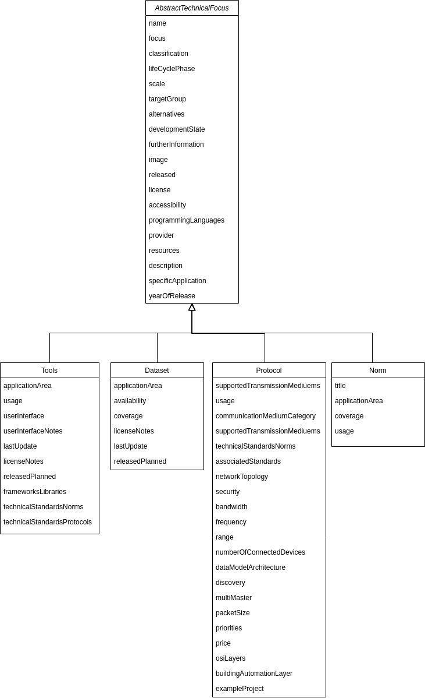

# Data model
This section describes the used data model. 

## Technical focus data model
The data model for the technical focus is composed of the django model classes `Tools`, `Dataset`, `Protocol` and `Norm`. Each of these classes corresponds to a table in the backend database, while an instanciated object corresponds to a row of the respective table.

The 4 models inherit a rich set of attributes from the abstract model class `AbstractTechnicalFocus`.
