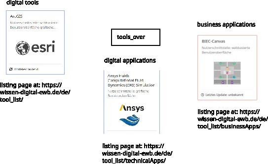

# Project repository structure
On this page the structure of the project repository is described. 

The root folder of the project contains global configuration files, text files for the interested github user and the `run`-script as a way to interact with the application. Furthermore 3 folders are present, namly `webcentral/`, `postgres/` and `nginx/`, which correspond to the basic docker containers of the application. These folders contain the files, which are relevant to the specfic containers. Their content is summarized briefly in the following sections.

## webcentral-folder
This folder contains the content relevant for the `django` application container. Inside `webcentral/` are 3 folders: `src/`, `doc/`, `test/`.
The `src/`-folder holds the source code of the django-application. The `doc/`-folder contains the collected data, which was imported into the database in spreadsheet files.

### Structure of the django src-folder
Below the `src/`-folder lies a typical `django`-project structure (For more information, visit [django-documentation](https://docs.djangoproject.com/en/5.1/)). In that folder also the `django` management-script `manage.py` is located, which can be used to interact with the `django` project. 
A typical `django` application is composed of several apps. These apps can be seen as independant building blocks of the project. Each app holds its own `models.py`, templates, `views.py` and `urls.py`. 
The `models.py` describes the data-layer of the application. It consists of classes, whereby each class is corresponding to a database table. Database columns are created as attributes of the class.
In the `views.py` a application logic is definied in the form of python methods. A method from the `views.py` is asigned to a website route. The mapping from route to view-function is done in the `urls.py`.
A view-function returns a response object. This python object represents the to be send back HTTP-response. In most cases in this project a HTML page is rendered from a template and context data. This HTML-page is then put into the HTTP response.
The templates are located in a folder `templates/`. inside that folder, each app has its own template-folder, containing the HTML-templates. Special template-folders are `pages/` and `partials/`, since these folders are not associated to an app. The `pages/`-folder holds templates, which are starting points for a page construction. Since the `django`-template engine allows composition, partial-templates from the `partials/`-folder are included into templates from the `pages/`-folder.

